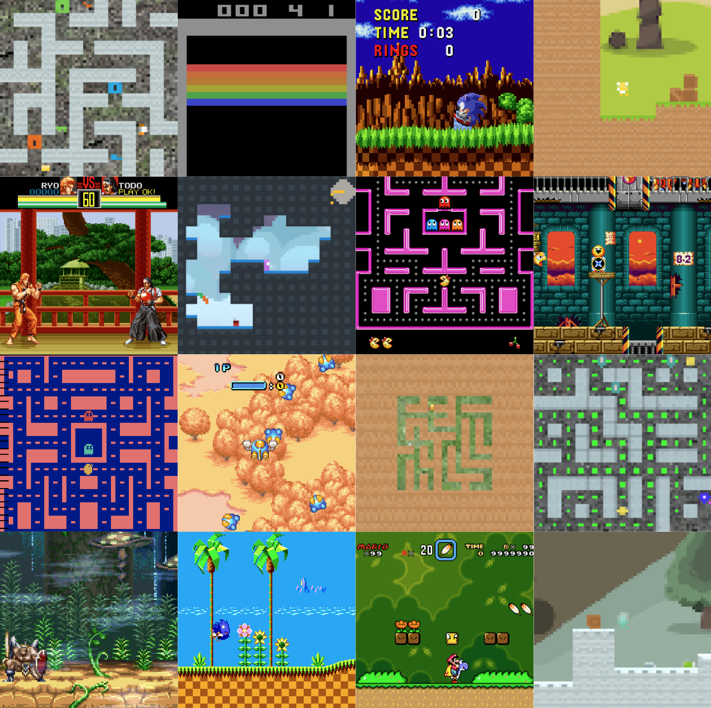

# `multitask-dojo`



`multitask-dojo` is a reinforcement learning environment for research on multi-task RL, generalization, and transfer learning. It essentially combines all games from Atari (via gym), gym-retro, procgen, and meta-arcade into a single multi-task environment. Additionally, it provides several convenience features:

- Vectorization: environment instances run in parallel on multiple cores. There are also additional features to mitigate the overhead from environment resets and task switching.
- Observation and action space normalization: all games are normalized to the same observation space (resolution and color depth). Actions are mapped from a joint (15-dimensional discrete) action space to game specific action spaces.
- Task scheduling: tasks can be selected by different schedulers (round-robin, minimal episodes, minimal frames, ..). PLR will be added to this repo in the near future.
- Logging: the library takes care of logging and exports episode statistics (returns, length,..), performance statistics, action distributions. These stats can also directly be logged to wandb.
- Task sets: for transfer learning/generalization research a list of clusters of similar tasks (e.g. platformer games, space invader-like games,..) is provided (split into train/test). 

## Installation

Installing the dependencies for dojo is slightly more involved since gym-retro doesn't include the necessary games and meta-arcade is not published on pypi. First install these requirements:

```
gym[atari] gym-retro procgen numpy wandb autorom imageio rich frozendict opencv-python scipy
```

Next run `AutoROM` to install the Atari ROMS in gym. Then follow the instructions [here](https://retro.readthedocs.io/en/latest/getting_started.html#importing-roms) to install ROMS for gym-retro. Finally, set up meta-arcade according to their instructions [here](https://github.com/lifelong-learning-systems/meta-arcade).

To verify that multitask-dojo was installed correctly, run `run_random_policy.py`. This will roll out a random policy in all games with the given number of worker processes.
